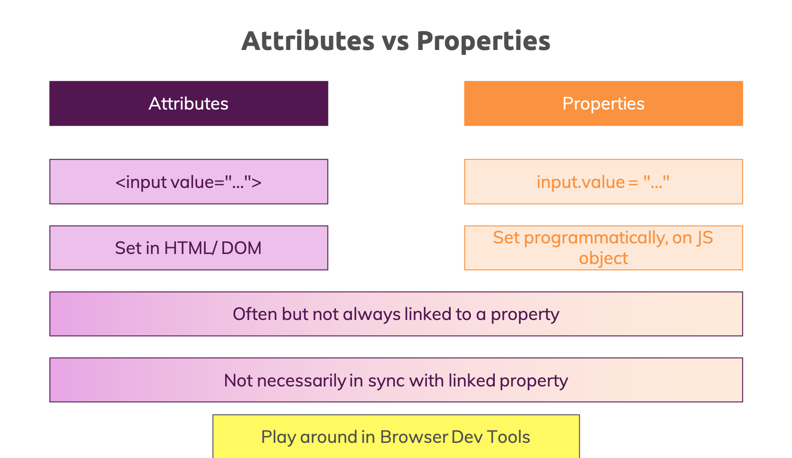

# Web Components & Stencil.js - Build Custom HTML Elements
Udemy training exercises

## References from the class

- [Browser Support Information](http://www.webcomponents.org)

- [CanIUse Information](https://caniuse.com/#feat=custom-elementsv1)

- [MDN Docs on Web Components](https://developer.mozilla.org/en-US/docs/Web/Web_Components)

## Web Component Lifecycle

1. constructor() - Element Created - Basic initializations
1. connectedCallback() - Element attached to DOM - DOM initializations
1. disconnectedCallback() - Element detached from DOM - Cleanup work
1. attributeChangedCallback() - Observed attributed updated - Update Data + DOM

## Attributes vs Properties

[attributes-vs-properties.pdf](attributes-vs-properties.pdf)
